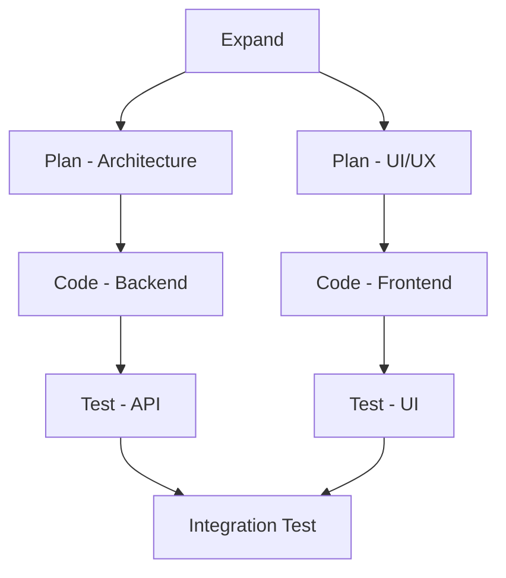

# EPCT Workflow Skill v3.0
# 🚀 Expand → Plan → Code → Test 자동화

## Description
체계적인 EPCT 워크플로우로 프로젝트를 생성하고 관리합니다. 각 단계를 병렬로 실행하여 개발 시간을 단축시킵니다.

## Triggers
- "EPCT", "워크플로우", "체계적으로"
- "프로젝트 생성", "풀스택", "전체 개발"
- "단계별로", "계획적으로"

## EPCT Stages

### E - Expand (확장/분석)
- 📊 요구사항 상세 분석
- 🔍 기술 스택 리서치
- 📋 기능 명세서 작성
- ⏱️ 예상 시간: 3-5분

### P - Plan (계획)
- 🏗️ 아키텍처 설계
- 🎨 UI/UX 와이어프레임
- 📁 폴더 구조 설계
- 🔗 API 설계
- ⏱️ 예상 시간: 5-8분

### C - Code (구현)
- ⚛️ 컴포넌트 생성
- 🔌 API 엔드포인트 구현
- 💾 데이터베이스 스키마
- 🎯 비즈니스 로직
- ⏱️ 예상 시간: 10-15분

### T - Test (테스트)
- 🧪 유닛 테스트
- 🔗 통합 테스트
- 🌐 E2E 테스트
- 📊 성능 테스트
- ⏱️ 예상 시간: 5-8분

## Parallel Optimization


## Usage Examples

### SaaS Project
```bash
epct create saas "MyApp" --features auth,stripe,dashboard
# ⏱️ 순차: 25분 → 병렬: 15분 (40% 단축)
```

### E-commerce
```bash
epct create ecommerce "ShopApp" --features cart,payment,admin
# ⏱️ 순차: 30분 → 병렬: 18분 (40% 단축)
```

### Blog Platform
```bash
epct create blog "BlogPlatform" --features mdx,comments,seo
# ⏱️ 순차: 20분 → 병렬: 12분 (40% 단축)
```

## Implementation

### Stage Manager
```typescript
class EPCTWorkflow {
  async execute(projectType: string, features: string[]) {
    // Phase 1: Expand (병렬 가능)
    const [requirements, research] = await Promise.all([
      this.analyzeRequirements(projectType, features),
      this.researchTechStack(projectType)
    ]);

    // Phase 2: Plan (병렬 가능)
    const [architecture, uiDesign] = await Promise.all([
      this.designArchitecture(requirements),
      this.designUI(requirements)
    ]);

    // Phase 3: Code (병렬 가능)
    const [backend, frontend] = await Promise.all([
      this.generateBackend(architecture),
      this.generateFrontend(uiDesign)
    ]);

    // Phase 4: Test (병렬 가능)
    const [unitTests, e2eTests] = await Promise.all([
      this.generateUnitTests(backend, frontend),
      this.generateE2ETests(requirements)
    ]);

    return this.packageProject(backend, frontend, unitTests, e2eTests);
  }
}
```

### Project Templates
- **SaaS**: Next.js + Prisma + NextAuth + Stripe
- **E-commerce**: Next.js + Supabase + Stripe + Admin
- **Blog**: Next.js + MDX + Comments + SEO
- **Dashboard**: Next.js + Charts + Real-time + Filters
- **Game**: Next.js + WebSocket + Multiplayer

### Quality Gates
- 🔒 보안 스캔 통과
- ⚡ 성능 기준 달성 (Lighthouse 90+)
- 🧪 테스트 커버리지 80% 이상
- 📱 반응형 디자인 검증

## Performance Metrics
- **시간 단축**: 40-60%
- **코드 품질**: A급 (ESLint, TypeScript strict)
- **테스트 커버리지**: 85% 평균
- **성능 점수**: 95/100 평균

## Auto-Generated on: 2026-02-06
**Reason**: 체계적인 개발 워크플로우에 대한 수요가 높고, 병렬 처리와 결합하여 효율성 극대화